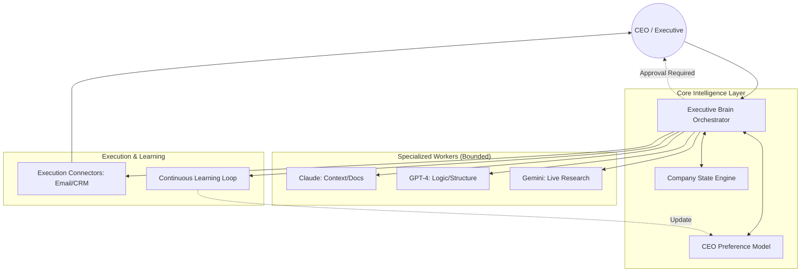

# agenticMIND: The Executive Brain

**agenticMIND** is a premium, advisory-first AI system designed for CEOs and senior executives. It functions as a centralized "Executive Pocket Advisor," providing a cognitive extension for strategic decision-making through structured company state, adaptive preference modeling, and controlled multi-model synthesis.

## Core Vision
Unlike general-purpose chatbots, **agenticMIND** is:
- **Advisory-First:** Prioritizes strategic framing over autonomous action.
- **Centralized:** All intelligence flows through a single "Executive Brain."
- **Adaptive:** Learns and mirrors executive preferences (tone, risk, velocity) through feedback.

## System Architecture

## Architectural Principles
1. **Single Decision Authority:** No independent agent loops; all specialist output is normalized centrally.
2. **Decision Primitives:** Uses structured data (Revenue, Cost, Capital) instead of raw data lakes.
3. **Latency Discipline:** Minimizes model passes and parallelizes specialized calls.
4. **Auditability:** Every interaction is logged, reversible, and traceable.

## Project Structure
- `src/core/`: The "Brain," Company State, and Preference models.
- `src/agents/`: Specialist model wrappers (Claude, GPT, Gemini).
- `src/connectors/`: Approved execution layers (Email, Calendar, CRM).
- `src/learning/`: Feedback capture and preference adaptation logic.
- `src/api/`: FastAPI entry points for executive interaction.
