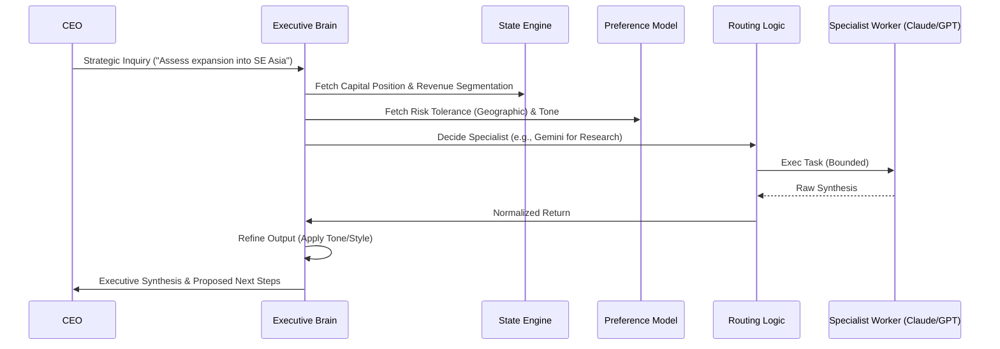
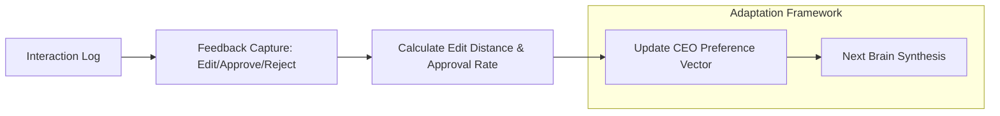

# Architectural Detail: agenticMIND

This document defines the two primary logic cycles of **agenticMIND**: the **Inquiry Synthesis Flow** (Inbound Tasks) and the **Preference Learning Loop** (Continuous Improvement).

## 1. Inquiry Synthesis Flow

This flow ensures that every CEO request is framed by the current company state and the CEO's personal preferences before any external models are engaged.

## 2. Preference Learning Loop

The system avoids neural weight retraining, instead using a structural adaptation loop to update the `CEOPreferenceModel`.

### Preference Metrics
- **Tone Alignment:** Track preferred vs. actual brevity.
- **Risk Convergence:** Update risk tolerance for specific domains based on rejection patterns.
- **Approval Rate:** Metric for system trust and routing efficiency.

## 3. Decision Primitives (Company State)
Rather than raw data, the **State Engine** maintains a high-level summary of:
- **Financials:** Revenue by segment, cost structure, and capital runway.
- **Operations:** Strategic initiatives, org structure, and regulatory footprint.
- **Velocity:** Historical decision-making speed for performance baselining.

## 4. Latency Mitigation
- **Parallelized Worker Calls:** Specialized agents are called simultaneously when dependencies permit.
- **Context Compression:** Only relevant primitives from the `CompanyState` are injected into prompts.
- **Caching:** Semantic caching for repetitive strategic queries.
